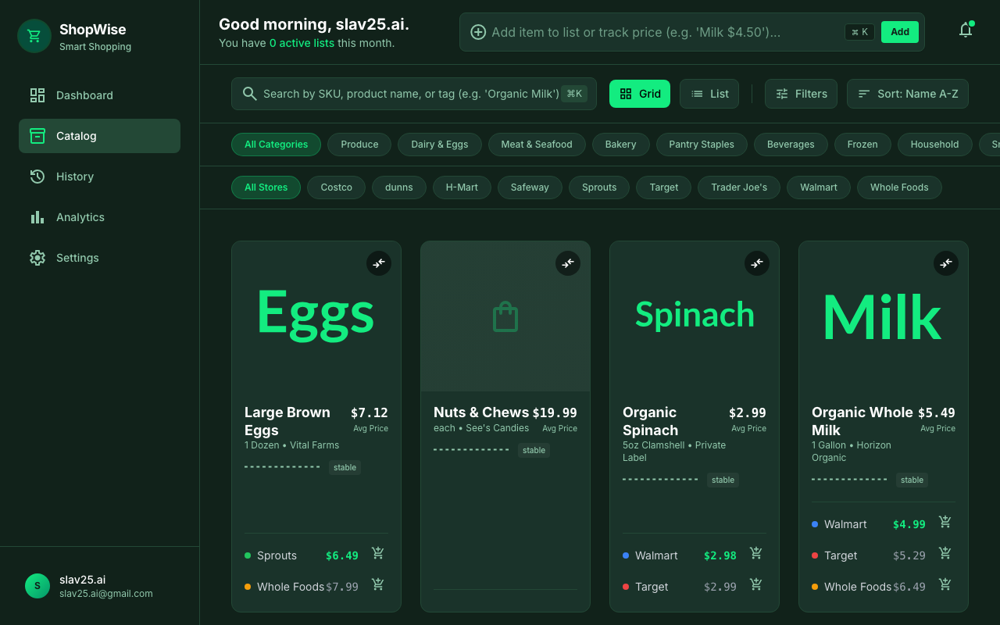
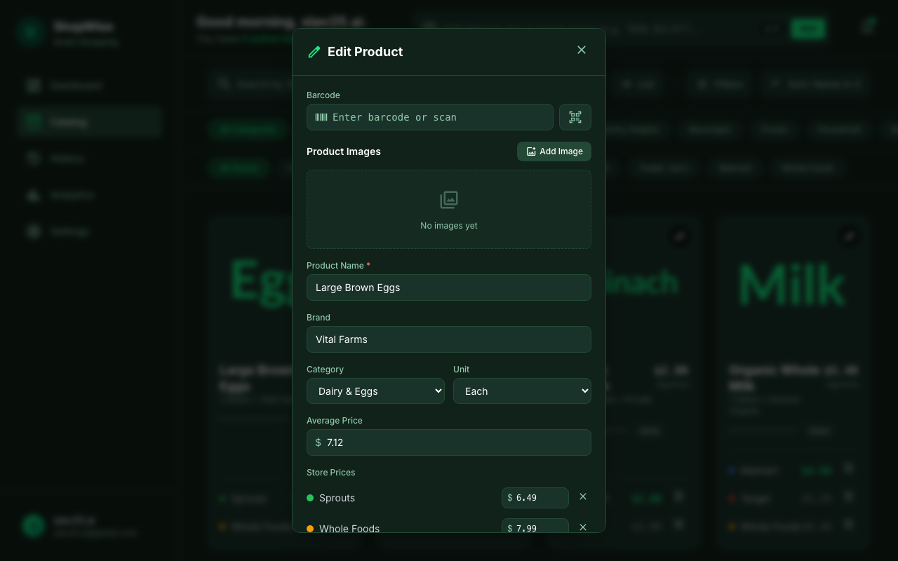

# ShopWise - Smart Shopping Assistant

A progressive web app (PWA) for managing weekly shopping efficiently. Scan items with your phone camera, track recurring purchases, calculate running totals while shopping, and share lists with family in real-time.

**Live**: [smartshoppinglist-sand.vercel.app](https://smartshoppinglist-sand.vercel.app)

---

## Features

### Shopping Lists
- Create, edit, and delete shopping lists
- Quick Add bar — type "Milk $4.50" to instantly add items
- Inline item editing (name, quantity, price)
- Check/uncheck items with optimistic updates & running totals
- Skip items you don't need this trip
- Delete items with undo support
- Budget tracking per list with progress bar
- Save lists as templates, create new lists from templates

### Product Catalog
- Browse products with store-specific pricing
- Search by name, brand, or barcode
- Filter by category, price range
- Sort by name, price, or volatility
- Compare products side-by-side
- Category-specific placeholder icons

### Barcode Scanning
- Scan barcodes with phone camera (ZXing)
- Auto-lookup product in catalog
- If not found: create new product with barcode, image, and pricing

### Product Images
- Upload product photos with compression (800px max, JPEG 85%)
- Multiple images per product
- Set primary image, delete images
- Lightbox viewer

### Real-Time Collaboration
- Share lists with other users (view or edit permission)
- Real-time updates via Supabase Postgres Changes
- Collaborator count badges

### Shopping History & Analytics
- Complete shopping trips with automatic metrics
- Filter history by date, store, spending
- Export CSV reports
- Spending analytics: monthly expenditure, category breakdown
- Period selection: Weekly, Monthly, Quarterly, YTD
- Export analytics reports

### Progressive Web App
- Installable on mobile devices
- Offline-capable with Workbox service worker
- Responsive design (mobile-first)

---

## Screenshots

### Product Catalog


### Edit Product Form (with Barcode Input)


---

## Tech Stack

| Layer | Technology |
|-------|-----------|
| Frontend | React 18 + TypeScript + Vite |
| Styling | Tailwind CSS (dark theme) |
| State | Zustand (6 stores) |
| Backend | Supabase (Auth, PostgreSQL, Storage, Realtime) |
| PWA | Workbox via vite-plugin-pwa |
| Icons | Material Symbols Outlined |
| Barcode | ZXing-js |
| Hosting | Vercel |

---

## Project Structure

```
ShopWise/
├── apps/web/src/
│   ├── components/        # Shared UI (AddProductForm, BarcodeScanner, PhotoCapture, ...)
│   │   └── ui/            # Design system (Button, Card, Icon, Modal, ProgressBar, ...)
│   ├── features/          # Feature modules
│   │   ├── dashboard/     # DashboardStats, ActiveListWidget, RecentActivityFeed
│   │   ├── shopping-list/  # ShoppingListItem, ListHeader, CompleteButton, BudgetHealth
│   │   ├── catalog/       # ProductCard, ProductGrid, CatalogToolbar, CategoryPills
│   │   ├── history/       # HistoryTable, HistoryStats, HistoryFilters
│   │   ├── analytics/     # AnalyticsKPIs, MonthlyBarChart, CategoryDonut
│   │   └── briefing/      # TripSummaryCard, InsightsList
│   ├── pages/             # Route pages (Auth, Dashboard, ActiveShoppingList, ...)
│   ├── store/             # Zustand stores (auth, lists, products, trips, analytics, ui)
│   ├── services/          # Supabase service layer (auth, lists, products, trips, ...)
│   ├── hooks/             # Custom hooks (useRealtimeList, useBarcodeScanner)
│   ├── lib/               # Supabase client, env config
│   └── utils/             # Export helpers, formatters
├── packages/shared/       # Shared TypeScript types
├── supabase/
│   ├── migrations/        # 10 SQL migration files
│   └── seed.sql           # Categories, stores, sample products
└── CALL_GRAPH.md          # Dynamic call graph documentation
```

---

## Dynamic Call Graph

See **[CALL_GRAPH.md](./CALL_GRAPH.md)** for the complete function call trace mapping every user action from UI → Store → Service → Database.

### Quick Reference

| Flow | Path | Status |
|------|------|--------|
| Login/Signup | AuthPage → authStore → authService → supabase.auth | ✅ |
| Create List | NewListDialog → listsStore → listsService → shopping_lists | ✅ |
| Delete List | ListHeader → listsStore → listsService → shopping_lists | ✅ |
| Add Item (Quick) | TopBar → listsService → list_items | ✅ |
| Add Item (Catalog) | ProductCard → listsService → list_items | ✅ |
| Add Item (Barcode) | BarcodeScanner → productsService → listsStore → list_items | ✅ |
| Edit Item | ShoppingListItem → listsStore → listsService → list_items | ✅ |
| Delete Item | ShoppingListItem → listsStore → listsService → list_items | ✅ |
| Check/Uncheck | ShoppingListItem → listsStore → listsService → list_items | ✅ |
| Skip Item | ShoppingListItem → listsStore → listsService → list_items | ✅ |
| Upload Image | AddProductForm → storageService → product-images bucket | ✅ |
| Multi Images | ProductImageGallery → storageService → product_images | ✅ |
| Share List | ShareListModal → sharingService → list_shares | ✅ |
| Real-Time | useRealtimeList → realtimeService → postgres_changes | ✅ |
| Complete Trip | CompleteButton → tripsStore → tripsService → shopping_trips | ✅ |
| View History | ShoppingHistoryPage → tripsStore → tripsService | ✅ |
| Analytics | SpendingAnalyticsPage → analyticsStore → analyticsService | ✅ |
| Export CSV | HistoryPage/Analytics → export utils → browser download | ✅ |

---

## Getting Started

### Prerequisites
- Node.js 18+
- Supabase project (or use the hosted instance)

### Development
```bash
# Install dependencies
npm install

# Start dev server
cd apps/web && npx vite

# Open http://localhost:5173
```

### Build
```bash
cd apps/web && npx vite build
```

### Database
```bash
# Apply migrations
npx supabase db push

# Seed data
npx supabase db seed
```

---

## Environment Variables

Create `apps/web/.env.local`:
```
VITE_SUPABASE_URL=https://your-project.supabase.co
VITE_SUPABASE_ANON_KEY=your-anon-key
```

---

## Database Schema

| Table | Purpose |
|-------|---------|
| profiles | User profiles (extends auth.users) |
| stores | Store directory (Walmart, Target, ...) |
| categories | Product categories (produce, dairy, ...) |
| products | Product catalog with barcode, image |
| store_products | Store-specific pricing |
| shopping_lists | User shopping lists |
| list_items | Items within lists |
| list_shares | List sharing permissions |
| price_history | Historical price tracking |
| shopping_trips | Completed shopping sessions |
| product_images | Multiple images per product |

All tables have Row Level Security (RLS) enabled with SECURITY DEFINER helper functions to prevent circular policy dependencies.

---

## License

Private project.
